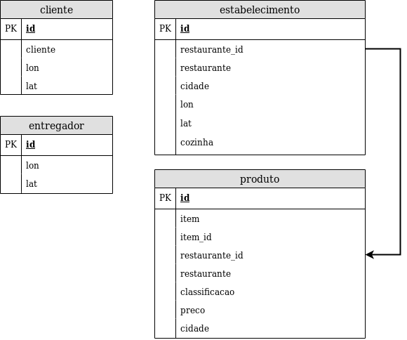

# Banco de daods



# Usando o banco de dados

Foi escolhido o banco de dados PostgreSQL para nossa solução.
Para facilitar o desenvolvimento, foi criada uma imagem Docker do
banco de dados já populado com os dados disponibilizados no desafio.

Essa imagem Docker está disponível de forma privada no repositório
[kmyokoyama/postgres-codenation](https://cloud.docker.com/repository/registry-1.docker.io/kmyokoyama/postgres-codenation).

## Instalando Docker e Docker Compose

Primeiramente, [instale o Docker](https://docs.docker.com/install/)
e o [Docker Compose](https://docs.docker.com/compose/install/). Também é sugerido
configurar o Docker para rodar sem `sudo`:

```shell
$ sudo groupadd docker
$ sudo gpasswd -a $USER docker
$ newgrp docker
$ docker run hello-world # Testa instalação do Docker.
$ docker-compose version # Testa instalação do Docker Compose.
```

## Executando a partir do Docker Compose

Antes de levantar a imagem do banco, lembre-se de logar no Docker Hub com `$ docker login`.

Para levantar a imagem do banco, simplesmente execute:

```shell
$ docker-compose up
```

O banco de dados PostgreSQL deve estar rodando na porta 5432 do host. Tente acessar
com:

```shell
$ psql --user devwarrior -d codenation -p 5432
```

## Executando sem o Docker Compose

Para levantar o banco e executá-lo diretamente pelo Docker sem o Docker Compose, execute:

```shell
$ docker run --rm -ti -p 5432:5432 -v postgres-data:/var/lib/postgres/data --name postgres-codenation kmyokoyama/postgres-codenation:latest
```

Novamente, o banco estará disponível no host na porta 5432.

## Criando a imagem a partir do Dockerfile

Para criar a imagem localmente, removendo a necessidade de acessar o Docker Hub:

* Ponha os arquivos csv neste diretório (`data/`).
* Execute `$ docker build --rm -t kmyokoyama/postgres-codenation:latest .`

Importante notar o ponto obrigatório no final do comando.

## Removendo o volume compartilhado

Em ambos comandos acima, foi criado um volume compartilhado no host para manter a persistência dos dados.
Isso pode ser importante devido à natureza efêmera dos containers Docker.

No entanto, se o banco de dados for alterado durante a execução do container, as alterações serão persistidas.
Se quiser apagar todas alterações feitas no banco e manter somente o estado original (como dar um reset no banco),
simplesmente remova os volumes:

```shell
$ docker volume rm data_postgres-data # Se executou com o Docker Compose.
$ docker volume rm postgres-data # Se executou diretamente com o Docker.
```